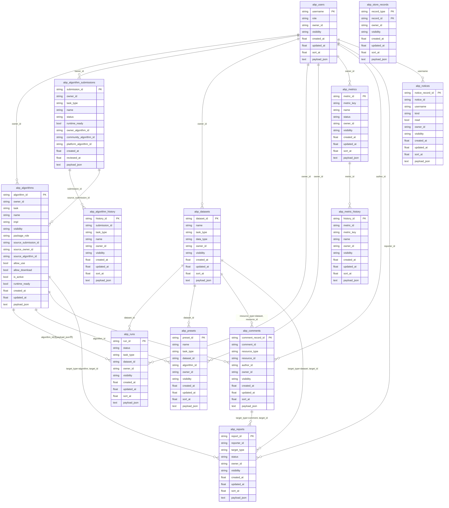

# Algo Benchmark Platform ER 图（当前 SQL 存储）

> 说明：
> - 该图基于 `backend/app/sql_store.py` 的当前建表定义整理。
> - 当前库中大多是“逻辑关联”（通过 `*_id` 关联），不是数据库层面的外键约束。
> - 大部分实体完整 JSON 都放在 `payload_json` 字段中，表内其它列主要用于检索/筛选/排序。

