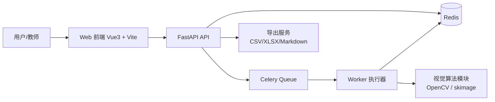
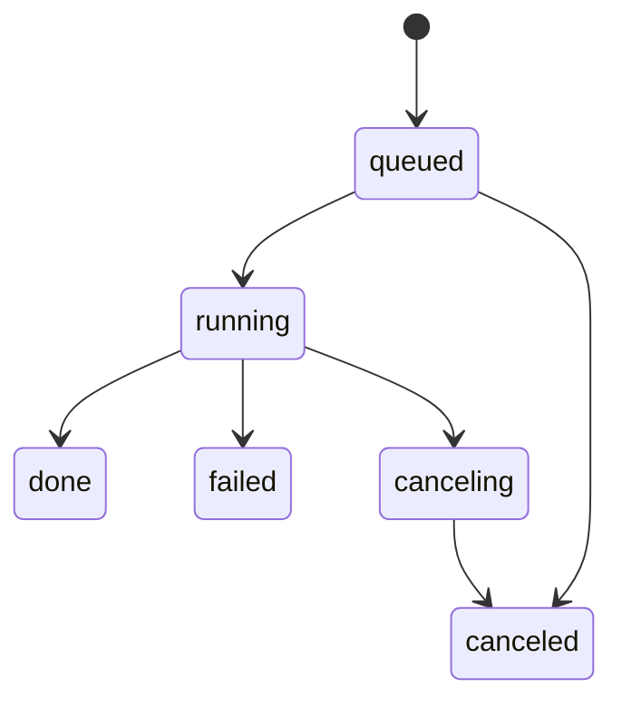
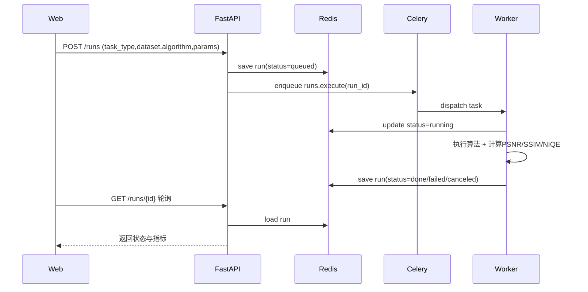
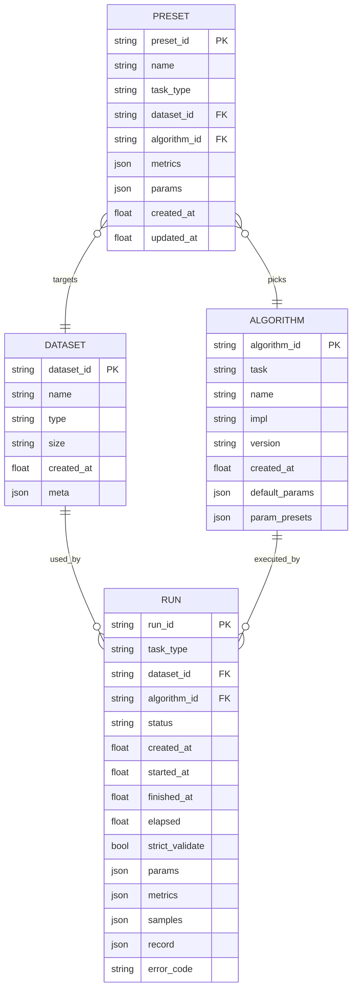

# 系统架构、流程、ER 与实现说明（G5）

## 1. 文档目的
- 给毕设答辩与论文撰写提供稳定的“系统设计说明”基线版本。
- 覆盖：总体架构、核心业务流程、数据模型（ER）、关键实现与主线验收映射。

## 2. 总体架构

### 2.1 分层职责
- Web：数据集管理、算法管理、Run 发起、对比分析、导出操作。
- API：参数校验、任务编排、状态查询、导出接口、错误码规范化。
- Redis：运行态与业务对象存储（run/dataset/algorithm/preset）。
- Worker：异步执行算法、计算指标、写回运行记录（record / metrics）。

## 3. 核心业务流程

### 3.1 Run 生命周期

### 3.2 端到端评测流程

## 4. 数据模型（ER）

## 5. 关键实现说明

### 5.1 图像与视频任务主线
- 图像任务：dehaze / denoise / deblur / sr / lowlight。
- 视频任务：video_denoise / video_sr（主线已联调通过）。
- `strict_validate=true` 时，按任务类型执行“同名配对检查”，无配对直接拒绝创建 Run。

### 5.2 异步与可观测性
- Run 由 Celery 异步执行，API 只负责入队与查询，不阻塞请求。
- Worker 持续写回：`record.runtime_resource`（wall/cpu/memory/attempt/retry）。
- 失败路径统一输出结构化错误码（error_code / error_message / error_detail）。

### 5.3 取消一致性
- 取消流程采用双保险：
  - run 记录内的 `cancel_requested/status=canceling`
  - 独立取消信号 `run_cancel:{run_id}`
- Worker 在关键节点检查取消信号，减少 late-cancel 被 done 覆盖的竞争窗口。

### 5.4 对比与推荐
- Compare 页使用统一指标口径做归一化加权排序（PSNR/SSIM/NIQE/耗时）。
- 支持 CSV/XLSX 导出与结论 Markdown 导出，形成可复盘材料。

## 6. 与验收清单的对应关系
- F-01~F-05：图像主线、列表筛选导出、Compare 推荐。
- E-01~E-05：结构化错误、严格校验、重试/耗尽、取消一致性。
- D-01~D-03：run.record 结构与导出口径一致。
- G3：视频任务端到端联调（API + Worker + Redis）已完成。

## 7. 交付建议（答辩/论文）
- 将本文件作为“系统设计与实现”章节骨架，直接拆分为：
  - 总体架构设计
  - 关键流程设计
  - 数据模型设计
  - 核心实现与鲁棒性设计
  - 验收与测试结果
